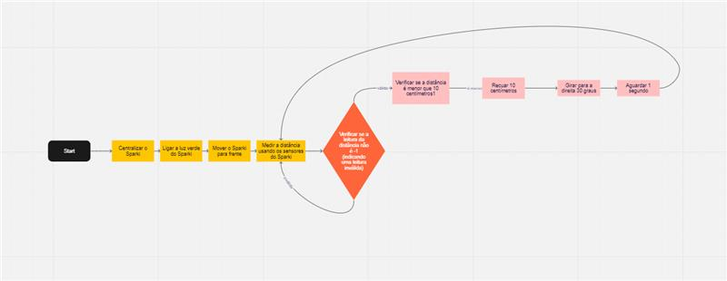

# Projeto 2 - Evitar a parede  <h1>

Esse código é uma demonstração de como o Sparki, através do uso do sensor ultrassônico (olhos), consegue medir uma distância entre ele e um objeto (parede de modo geral) para evitar colidir com o mesmo. 

O código consiste nas seguintes ações a ser realizada pelo Sparki:
  
1- Centralizar;
  
2- Ligar a luz verde para indicar movimento e/ou que nenhum objeto foi encontrado pelo sensor ultrassônico ("olhos") em sua frente;
  
3- O sparki começa a se mover para frente e conforme vai "andando" seus olhos vão medindo a distância até o objeto(parede) ;
  
4- Se a distância até a objeto(parede) for menor que 10 centímetros, a luz vermelha acende e o sparki faz um recuo de 10 cm e gira para direita a 30º graus;
  
5- Se essa distância for maior que 10 cm, então o Sparki liga a luz verde e segue em frente;   
  
6- Para cada iteração dentro da distância menor que 10 cm, o delay é entorno de 1 segundo. Nas iterações fora desse escopo, o delay é entorno de 0,1 segundos.

## Link do vídeo yotube: 
[Vídeo do robô executando código](https://youtu.be/40Cb48vQb9c)  

  ## Fluxograma 
  
Essa documentação descreve o fluxograma do programa Sparki passo a passo. O Sparki realizará um movimento para frente, medirá a distância e tomará ações com base na leitura. Se a distância for menor que 10 centímetros, o Sparki recuará, girará para a direita e aguardará 
antes de retornar ao loop principal. O programa continuará a executar essas ações repetidamente enquanto estiver em execução.
  
1. Configuração Inicial (Setup Function):

Início do programa.
A biblioteca Sparki é incluída.
A função setup() é chamada.
Dentro da função setup(), o servo do Sparki é centralizado usando sparki.servo(SERVO_CENTER).
Fim da função setup().
Fluxo retorna para o loop principal.
  
2. Loop Principal (Loop Function):

Início do loop principal.
A função loop() é chamada repetidamente.
  
3. Funcionalidades Principais:

A luz verde do Sparki é ligada usando sparki.RGB(RGB_GREEN).
O Sparki se move para frente usando sparki.moveForward().
A distância é medida usando os sensores do Sparki com int cm = sparki.ping().
Verificação da leitura de distância:
Se cm for diferente de -1, ou seja, se a leitura for válida:
Verificação da distância:
Se a distância (cm) for menor que 10 centímetros:
A luz vermelha do Sparki é ligada usando sparki.RGB(RGB_RED).
É emitido um beep usando sparki.beep().
O Sparki recua 10 centímetros usando sparki.moveBackward(10).
O Sparki gira para a direita 30 graus usando sparki.moveRight(30).
Há uma pausa de 1 segundo usando delay(1000).
Fim da verificação de distância.
Fim da verificação de leitura de distância.
  
4. Pausa e Retorno ao Loop Principal:

Após as funcionalidades principais, há uma pausa de 0,1 segundos usando delay(100).
O fluxo retorna ao início do loop principal.
  
5. Repetição do Loop Principal:

O programa continuará a repetir o loop principal indefinidamente, executando as funcionalidades descritas nos passos 3 e 4.
  

