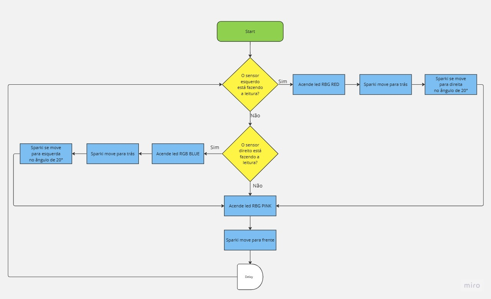

# Projeto 1 - Evitar borda, Não cair RGB <h1>

Esse código é uma demonstração de como o Sparki pode evitar quedas ao detectar as bordas de uma superfície. Ele utiliza dois sensores infravermelhos para medir a proximidade das bordas esquerda e direita.

O código consiste em algumas ações realizadas pelo Sparki:

1. Medir a proximidade da borda esquerda usando o sensor IR esquerdo.
2. Se a proximidade for menor que um determinado limite (threshold = 200), indicando que não há superfície abaixo do sensor, o Sparki acende o LED RGB na cor vermelha, recua uma distância pré-definida e vira à direita em um ângulo também pré-definido.
3. Em seguida, o Sparki mede a proximidade da borda direita usando o sensor IR direito.
4. Se a proximidade for menor que o limite estabelecido, indicando a ausência de superfície abaixo do sensor direito, o Sparki acende o LED RGB na cor azul, recua a mesma distância e vira à esquerda no mesmo ângulo.
5. Se não houver detecção de bordas em ambos os sensores, o LED RGB acende na cor rosa e o Sparki segue em frente.
6. O código inclui um pequeno atraso de 0.1 segundos entre cada iteração do loop.

## Link do vídeo yotube: 
[vídeo do robô executando](https://youtu.be/We9_DYo-2kw)  

  ## Fluxograma 
  
Para melhor visualização das etapas que o Sparki deve realizar, o fluxograma abaixo exemplifica a sequência e as decisões que devem ser seguidas de maneira linear. Ele é inicializado no Void Loop com a primeira condição de IF, que representa a leitura do sensor esquerdo. Caso algo seja detectado instantaneamente, o led RGB RED é ligado. Em seguida, o Sparki move para trás e se redireciona para a direita em um ângulo de 20°. Ele continua seguindo em frente até que caia novamente em alguma condição.

O mesmo processo se repete para a segunda condição de IF, onde é realizada a leitura do sensor direito. Quando algo é detectado, o led RGB BLUE é ligado. Em seguida, o Sparki move para trás e se redireciona para a esquerda com um ângulo de 20°. Após esses processos, o robô é programado para seguir em frente até que uma nova análise dos sensores seja feita.

Em um último caso, quando nenhuma condição IF é verdadeira, o Sparki é direcionado a continuar seguindo em frente enquanto nenhuma leitura é detectada, o led RGB PINK é ligado. Por isso, temos um loop e um delay para que haja um tempo de leitura antes da ação.
  

