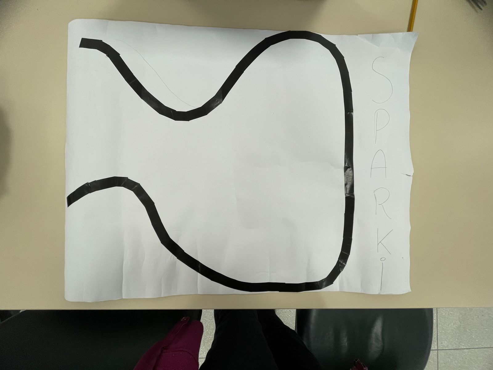

# Projeto 4 - Seguir Linha <h1>
  
O código apresenta uma demonstração de como o Sparki utiliza seus sensores de refletância infravermelha para seguir uma linha. Um limite, chamado de "threshold", é definido para determinar o que é considerado
  preto e branco. Os sensores indicam valores próximos a 900 para branco e em torno de 200 para preto. Neste exemplo, o limite é definido como 450.

No loop principal, o código realiza as seguintes ações:

1. Lê os valores dos sensores de linha esquerdo, central e direito.
2. Verifica se a leitura do sensor da linha esquerda está abaixo do limite. Se sim, o Sparki vira à esquerda.
3. Verifica se a leitura do sensor da linha direita está abaixo do limite. Se sim, o Sparki vira à direita.
4. Verifica se apenas o sensor da linha central está lendo uma linha, enquanto os sensores esquerdo e direito não estão. Nesse caso, o Sparki segue em frente.
5. Limpa a tela do display LCD.
6. Imprime na tela as leituras dos sensores de linha esquerdo, central e direito.
7. Atualiza o display LCD para exibir todas as informações.
8. Aguarda 0,1 segundos antes de realizar a próxima iteração do loop.
  
Essa demonstração permite ao Sparki seguir uma linha usando os sensores de refletância infravermelha, tomando decisões de movimento com base nas leituras desses sensores.
  
Durante a realização deste projeto, além de implementar o código para o Sparki seguir a linha com base nas leituras dos sensores de refletância infravermelha, também construímos um mapa de linha para auxiliar na 
navegação do robô. O mapa de linha consiste em uma trilha desenhada em uma cartolina com cores contrastantes em relação ao fundo, permitindo que o Sparki siga essa rota com mais precisão.

O mapa de linha é fundamental para criar um ambiente controlado e definir a trajetória desejada para o Sparki. Com o mapa de linha e o código implementado, o robô é capaz de detectar a linha e realizar os movimentos 
adequados para permanecer no percurso definido, facilitando sua movimentação de forma autônoma.

Dessa forma, o projeto abrange não apenas o desenvolvimento do código e a programação do Sparki, mas também a construção física do mapa de linha, proporcionando uma experiência completa de navegação controlada pelo robô. 
  
  
  
  
  
  
  
  
  
  
  
  ## Link do video youtube: 
  [Vídeo do robô executando código](https://youtu.be/7W2G3xKUP0c) 
  
  ## Fluxograma
  
  Neste fluxograma, temos as caixas representando cada seção ou etapa do código. O fluxo de execução começa com a configuração inicial, passa para o loop principal e repete até o programa ser encerrado. 

Dentro do loop principal, temos a definição do threshold, leitura dos sensores de linha e as verificações das leituras para determinar as ações do Sparki, ou seja, orientar o robô para qual direção deverá seguir conforme a função "sparki.move".

O programa também atualiza e exibe as informações no LCD antes de fazer uma pausa de 0,1 segundos e retornar ao loop principal, o fluxo é contínuo e repete essas etapas enquanto o programa estiver em execução.
  
  
