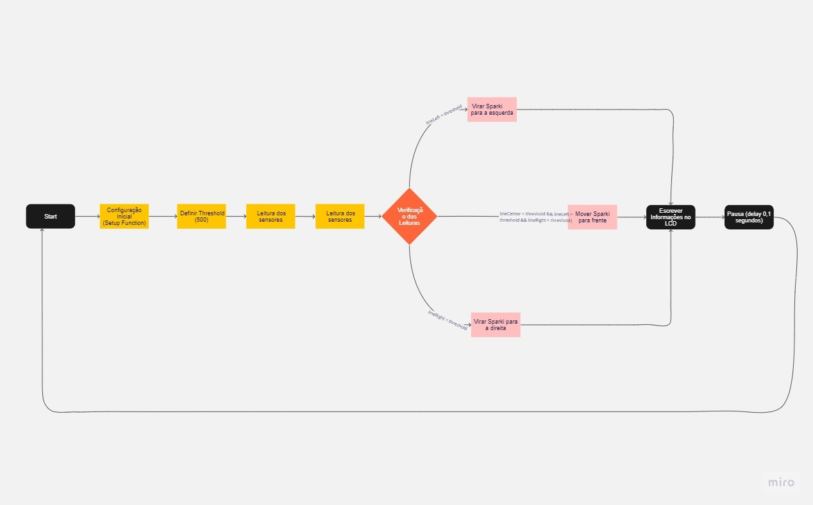

# Projeto 4 - Seguir Linha <h1>
  

  
  
  
  
  
  
  
  
  
  
  
  
  ## Link do video youtube: 
  [Vídeo do robô executando código](https://youtu.be/7W2G3xKUP0c) 
  
  ## Fluxograma
  
  Neste fluxograma, temos as caixas representando cada seção ou etapa do código. O fluxo de execução começa com a configuração inicial, passa para o loop principal e repete até o programa ser encerrado. 
  Dentro do loop principal, temos a definição do threshold, leitura dos sensores de linha e as verificações das leituras para determinar as ações do Sparki. O programa também atualiza e exibe as informações
  no LCD antes de fazer uma pausa de 0,1 segundos e retornar ao loop principal. O fluxo é contínuo e repete essas etapas enquanto o programa estiver em execução.
  
  
